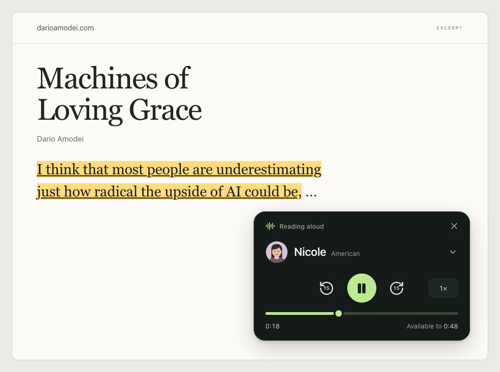
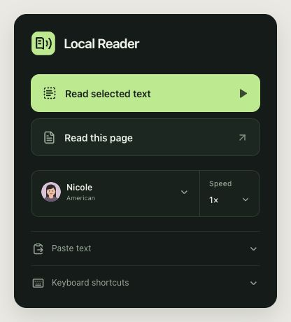
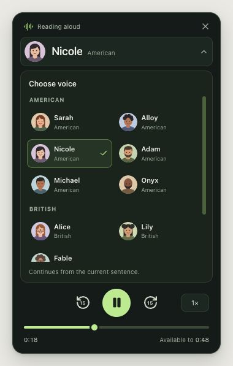

# Local Reader

Turn a selected passage or a full article into speech without leaving the page. Local Reader runs in Chrome, keeps speech processing on your machine, and places a compact player beside the text.

Local Reader includes **Kokoro**, an open-source text-to-speech model that turns text into audio locally for nine bundled English voices. Local Reader adds playback controls and page highlighting. On macOS, an optional helper can instead use the system voice selected for **Start Speaking**.

<p><picture>
  <source media="(max-width: 600px)" srcset="docs/assets/reader-overview-mobile.png">
  
</picture></p>

*Local Reader playback and highlighting with Kokoro, illustrated with an excerpt from Dario Amodei’s [Machines of Loving Grace](https://darioamodei.com/essay/machines-of-loving-grace).*

[Get started](#build-from-source) · [Choose a voice](#choose-a-voice) · [Current limits](#what-to-expect) · [Technical notes](tts-ext/README.md)

## Read where you are

Select text and choose **Read aloud**, open the extension to read the current article, or paste text into the popup. An explicit request opens the page player; Local Reader does not add UI to every site in advance.

<table>
  <tr><th>Start reading</th><th>Switch voices</th></tr>
  <tr>
    <td valign="top"></td>
    <td valign="top"></td>
  </tr>
</table>

*The current popup and player, shown with an example reading state.*

With the bundled voices, Local Reader supports pause and resume, 0.5×–2× speed, ±15-second movement, an accessible timeline, replay, and Close. On a source page, the highlight follows the sentence tied to generated audio and clears when the reading ends. Pages share one reading session: newer requests replace pending launches, and Close cancels pending launches before releasing the current reader.

## Choose a voice

Click the voice's portrait or name in the player or popup. Your choice applies to the current reading and is saved for the next one. Kokoro continues from the start of the current sentence; a paused reading stays paused until you press Play. Switching away from Mac **Start Speaking** restarts the passage because it provides no playback position.

| Feature | Bundled voices (Kokoro) | Mac system voice |
|---|---|---|
| **Voices** | Nine bundled English voices, including Nicole | The current macOS system voice |
| **Playback** | Pause/resume, speed, seek/skip, timeline, replay, Stop/Close | Start, Stop, and whole-text replay |
| **Highlighting** | Sentence- or chunk-level cues from generated audio | Unavailable because the system route supplies no speech timing |
| **Setup** | Included in the built extension; WebGPU preferred, WASM fallback | Separate helper registered to the documented extension ID |

Additional Mac playback controls are tracked in [issue #1](https://github.com/IonMich/tts-chrome/issues/1). Confirming native speech shutdown before replacement remains tracked in [issue #15](https://github.com/IonMich/tts-chrome/issues/15).

## Build from source

Requires **Node.js 22.9.0+** and **Chrome 116+**.

```sh
git clone https://github.com/IonMich/tts-chrome.git
cd tts-chrome/tts-ext
npm ci
npm run prepare:assets
npm run build
```

`prepare:assets` verifies the pinned speech assets and obtains missing files. The original fp32 Kokoro model is about 325 MB, so first preparation can take time.

Open `chrome://extensions`, enable **Developer mode**, choose **Load unpacked**, and select:

```text
tts-chrome/tts-ext/.output/chrome-mv3
```

Refresh the article after rebuilding or reloading. The bundled Kokoro voices are ready from that unpacked build. The Mac helper remains a developer setup tied to the existing extension ID; follow its [guarded install and rollback instructions](native/mac/README.md). A packaged release still needs the source-provenance and notice work tracked in [issue #3](https://github.com/IonMich/tts-chrome/issues/3).

## What to expect

Article extraction works best on ordinary pages with a clear article or main region. Select the exact passage on complex pages. Chrome settings pages and some PDF viewers cannot host the injected player.

Kokoro synthesis can be demanding on some machines. Controls stay within generated, retained audio, and highlighting follows sentence or chunk cues rather than word alignment. See the [verification history](docs/verification.md) for tested hardware, results, and remaining limits.

Speech text and generated audio stay in the local reading path. Voice and speed preferences use Chrome sync storage and may follow the browser's configured sync behavior. Building from source obtains pinned third-party assets; ordinary reading uses the packaged local copies.

## More detail

- [Extension architecture and developer checks](tts-ext/README.md)
- [Mac helper setup and rollback](native/mac/README.md)
- [Verification history and measurement boundaries](docs/verification.md)
- [Kokoro GPU diagnosis](docs/evidence/kokoro-freeze/FINDINGS.md)
- [Third-party speech notices](tts-ext/src/public/THIRD_PARTY_SPEECH_NOTICES.md)
